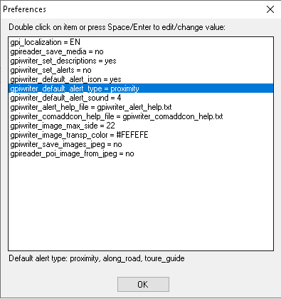

# KMZ Rebuilder

[English](https://github.com/dkxce/KMZRebuilder#EN) | [Русский](https://github.com/dkxce/KMZRebuilder#RU)

## EN

**KMZRebuilder** is a powerfull tool thats allow to create/edit/manage/split/merge/import/export/explore/sort yours POI.    
Working with points, polylines and polygons. You can filter POI by text, routes/tracks, polylines or geozones/polygons/areas.    

Support KMZ/KML files from [Google](https://www.google.com/maps/d/) and [SAS.Planet](http://www.sasgis.org/sasplaneta/) and GPI (Garmin Points of Interests).    
Supported formats: KMZ, KML, GPI, Progorod, WPT, GDB, FIR, TXT, CSV, DB3 (SAS.Planet), Raster [MBTiles](https://wiki.openstreetmap.org/wiki/MBTiles), Clipboard.        

You can export result kmz file to HTML Map and upload it to your site.    

**This is a special tool to edit kmz files**:    
- Add, remove, rename placemarks & points.
- Change icons.
- Move points.
- Split and merge kmz files.
- Direct Import & Export GPI files (GPI Converter).    
- Get Routes (dkxce & [OSRM](http://project-osrm.org/docs/v5.15.2/api/)).    
- Import data from plugins.

**GPI Import/Export**:
- Multilanguage (EN or any latin, RU or any ciryllic)
- Layers (Categories) & POIs 
- [POI Description](https://github.com/dkxce/KMZRebuilder/blob/master/bin/Debug/gpiwriter_comaddcon_help.txt)
- [POI Comment](https://github.com/dkxce/KMZRebuilder/blob/master/bin/Debug/gpiwriter_comaddcon_help.txt) (load/save from/to desc)
- [POI Address](https://github.com/dkxce/KMZRebuilder/blob/master/bin/Debug/gpiwriter_comaddcon_help.txt) (load/save from/to desc)
- [POI Contact](https://github.com/dkxce/KMZRebuilder/blob/master/bin/Debug/gpiwriter_comaddcon_help.txt) (load/save from/to desc)
- [POI Alert](https://github.com/dkxce/KMZRebuilder/blob/master/bin/Debug/gpiwriter_alert_help.txt) (load/save from/to desc) with sound (wav, mp3) & trigger options
- POI Bitmap (get/set from/to kml style)
- POI Image (get/set from/to kml style)
- Voice Alerts (load/save from/to desc)     
- Command Line (Batch Mode): /kmz2gpi `kmzfile` `gpifile`    
- Command Line (Batch Mode): /gpi2kmz `gpifile` `kmzfile`    

You can use result files in [KMZViewer](https://github.com/dkxce/KMZViewer), [OruxMaps](http://oruxmaps.com), [Google Maps](https://www.google.com/maps/d/), [SASPlanet](http://www.sasgis.org/sasplaneta/) and more others...

## RU

**KMZRebuilder** - мощная программа для работы с KMZ/KML/GPI файлами. Импорт/экспорт/создание/редактирование ваших точек интереса в одном удобном интерфейсе. Подключение внешних тайлов и импорт из других форматов. Работа со слоями. Экспорт точек в навигаторы. Обработка треков, полилиний, полигонов и прочие возможности. 

Открывает файлы, сохраненные в [Google Maps](https://www.google.com/maps/d/), [SASPlanet](http://www.sasgis.org/sasplaneta/).       
Отображает вложенные в файл (kmz) картинки и картинки по url.      
Отсутствует прямое ограничение на количество отображаемых объектов.      

Повзоляет фильтровать, сортировать, изменять объекты.    
Поддерживает точки, полигоны, линии и значки.      
Поддерживает отображение точек из файлов GPI (Garmin Points of Interests).    

Умеет сохранять данные в KMZ, CSV, HTML, RTF, WPT, Progorod, GPI.     

Поддерживает визуализацию маршрутов dkxce Route Engine и [OSRM](http://project-osrm.org/docs/v5.15.2/api/).     

Работает с OSM тайлами, Google, Ovi, Here, Kosmosnimki.
Пожжерживат пользовательские тайлы.
Возможность загружать тайлы с произвольных серверов.
Умеет работать с кэшем SAS.Планета.
Умеет работать с тайлами, сохранеными на диске.

**Экспорт (и импорт) точек в навигаторы**:
- Garmin
- Navitel
- Прогород
- OziExplorer
- OruxMaps
- Locus

**Полноценная поддержка GPI файлов**:
- Multilanguage (EN or any latin, RU or any ciryllic)
- Категории объектов (Layers (Categories))
- Точки интересов (POI)
- Примечания (POI Description)
- Комментарии (POI Comment (load/save from/to desc))
- Адресная информация (POI Address (load/save from/to desc))
- Контактная информация (POI Contact (load/save from/to desc))
- Предупреждения (POI Alert (load/save from/to desc)) со звуками и установками срабатывания      
- Голосовые предупреждения     
- Иконки (POI Bitmap (get/set from/to kml style))
- Картинки (POI Image (get/set from/to kml style))

[KMZ files Repository](https://github.com/dkxce/KMZ_FILES)     
[Репозиторий KMZ файлов](https://github.com/dkxce/KMZ_FILES)    

Плагины:
* [AvtodorM4Tarrifs](https://github.com/dkxce/AvtodorM4Tarrifs) - Получение тарифов М4 для планировщика маршрутов
* [TransitCard](https://github.com/dkxce/TransitCardGrabber) - Карта заправок 
* [RusPetrol](https://github.com/dkxce/RusPetrolGrabber) - Карта заправок
* [TvilGrabber](https://github.com/dkxce/TvilGrabber) - Карта объектов

Main Window (основное окно)     
     
Map Window (окно карты)     
     
Map Window (окно карты)     
     
GPX Tachograph (тахограф)     
     
Map poly creator (окно создание полигонов)     
     
Compress track (окно интерполяции треков)     
     
Track planner (окно планировщика маршрутов)     
     
Lat/Lon Converter (окно преобразования координат)     
     
Main Menu (основное меню)     
     
Tools Menu (меню утилит)     
     
Layers Menu (меню слоев карты)     
     
Route Sample (вывод маршрутов)     
     
GPI Preferences     
     
