# KMZ Rebuilder

**KMZRebuilder** is a powerfull tool thats allow to create/edit/manage/split/merge/import/export/explore/sort yours POI.    
Working with points, polylines and polygons. You can filter POI by text, routes/tracks, polylines or geozones/polygons/areas.    

Support KMZ/KML files from [Google](https://www.google.com/maps/d/) and [SAS.Planet](http://www.sasgis.org/sasplaneta/) and GPI (Garmin Points of Interests).    
Supported formats: KMZ, KML, GPI, Progorod, WPT, GDB, FIR, TXT, CSV, DB3 (SAS.Planet), Raster [MBTiles](https://wiki.openstreetmap.org/wiki/MBTiles), Clipboard.        

You can export result kmz file to HTML Map and upload it to your site.    

This is a special tool to edit kmz files:    
- Add, remove, rename placemarks & points.
- Change icons.
- Move points.
- Split and merge kmz files.
- Direct Import & Export GPI files.    
- Get Routes (dkxce & [OSRM](http://project-osrm.org/docs/v5.15.2/api/)).    
- Import data from plugins.

You can use result files in [KMZViewer](https://github.com/dkxce/KMZViewer), [OruxMaps](http://oruxmaps.com), [Google Maps](https://www.google.com/maps/d/), [SASPlanet](http://www.sasgis.org/sasplaneta/) and more others...

KMZRebuilder - мощная программа для работы с KMZ/KML файлами. Импорт/экспорт/создание/редактирование ваших точек интереса в одном удобном интерфейсе. Подключение внешних тайлов и импорт из других форматов. Работа со слоями. Экспорт точек в навигаторы. Обработка треков, полилиний, полигонов и прочие возможности. 

[KMZ files Repository](https://github.com/dkxce/KMZ_FILES)     
[Репозиторий KMZ файлов](https://github.com/dkxce/KMZ_FILES)    

Плагины:
* [AvtodorM4Tarrifs](https://github.com/dkxce/AvtodorM4Tarrifs) - Получение тарифов М4 для планировщика маршрутов
* [TransitCard](https://github.com/dkxce/TransitCardGrabber) - Карта заправок 
* [RusPetrol](https://github.com/dkxce/RusPetrolGrabber) - Карта заправок
* [TvilGrabber](https://github.com/dkxce/TvilGrabber) - Карта объектов

Main Window (основное окно)     
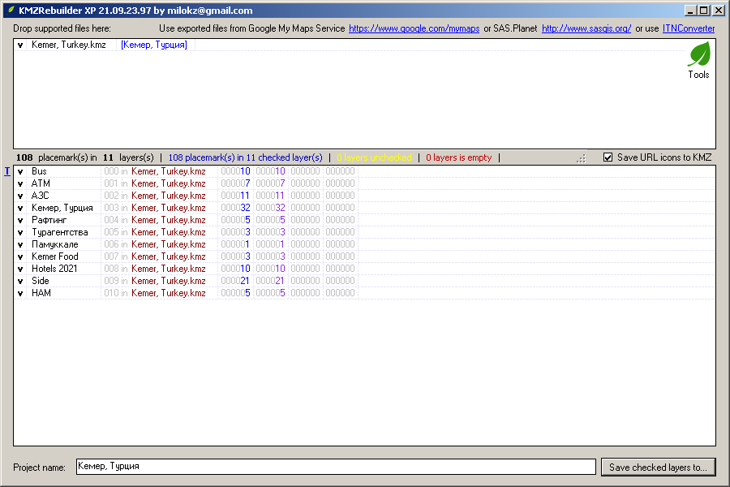     
Map Window (окно карты)     
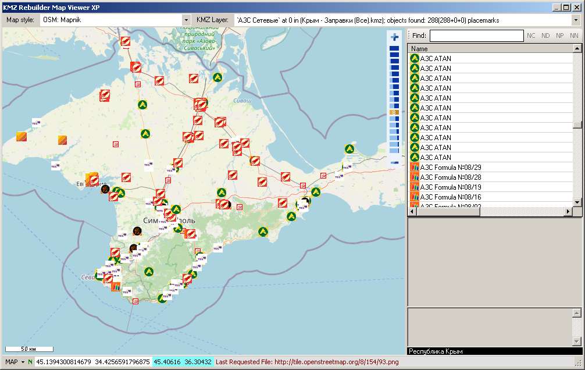     
Map Window (окно карты)     
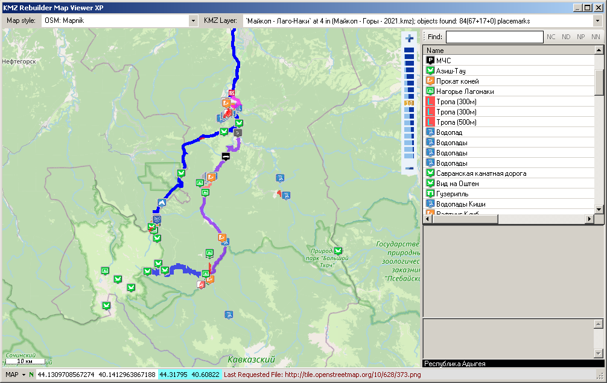     
GPX Tachograph (тахограф)     
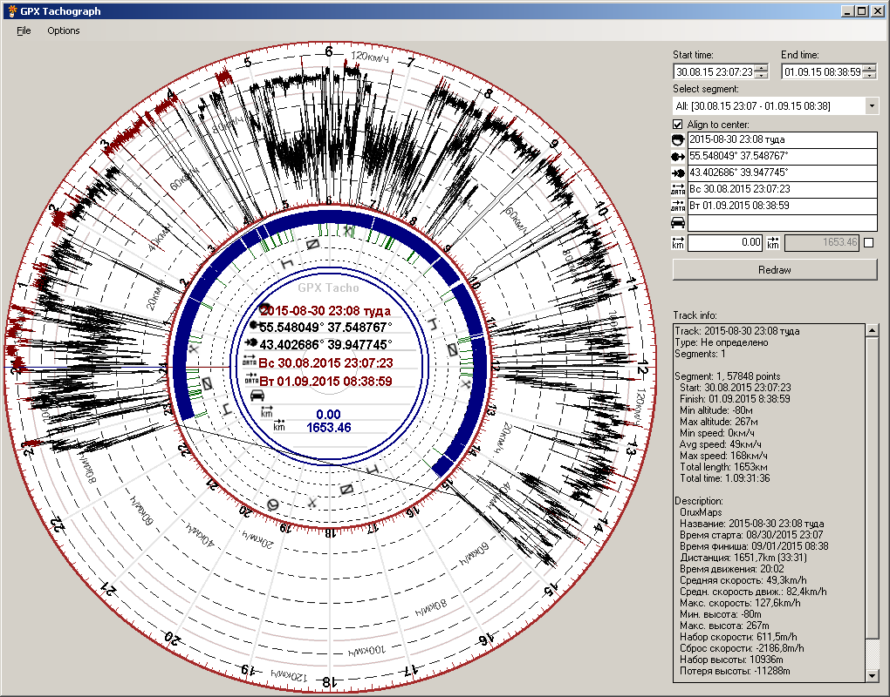     
Map poly creator (окно создание полигонов)     
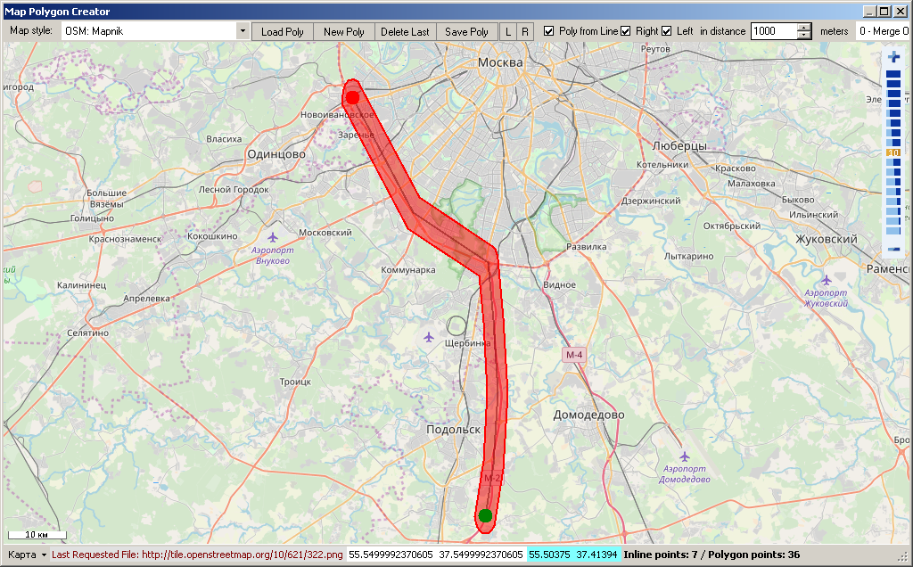     
Compress track (окно интерполяции треков)     
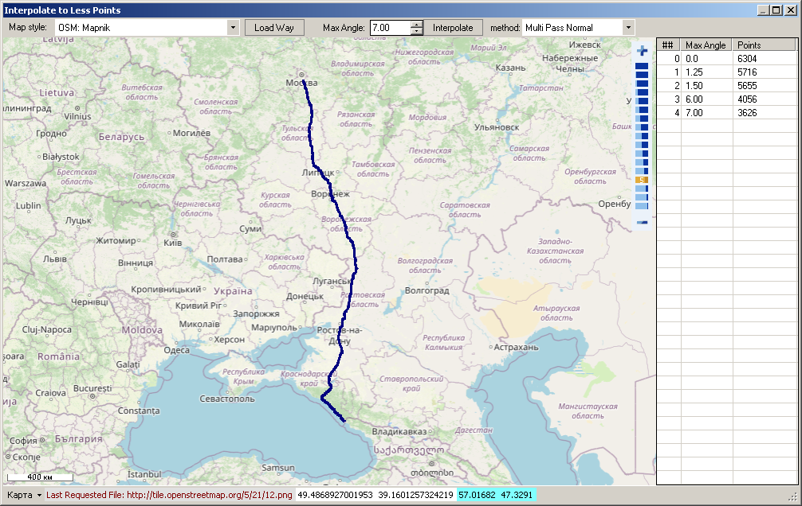     
Track planner (окно планировщика маршрутов)     
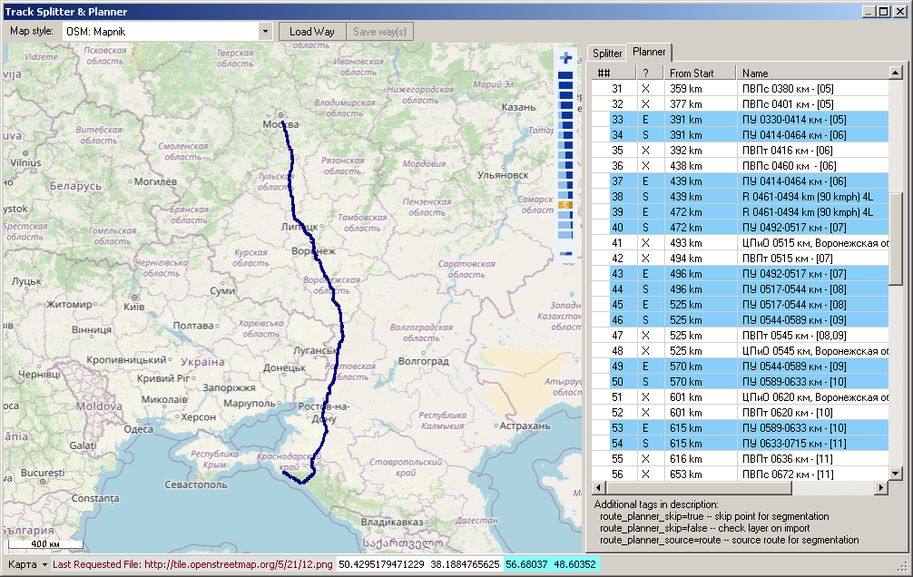     
Lat/Lon Converter (окно преобразования координат)     
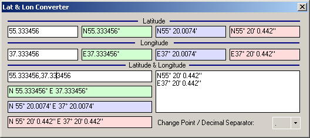     
Main Menu (основное меню)     
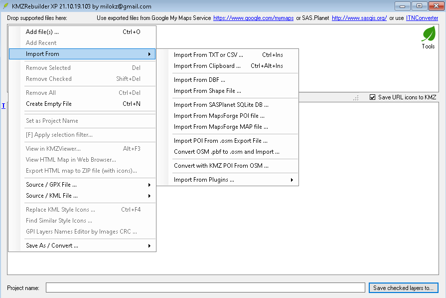     
Tools Menu (меню утилит)     
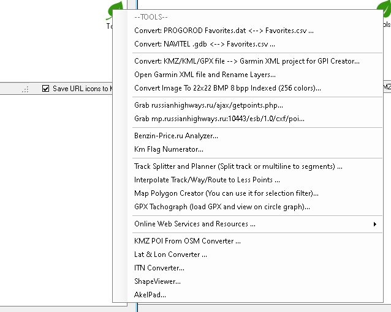     
Layers Menu (меню слоев карты)     
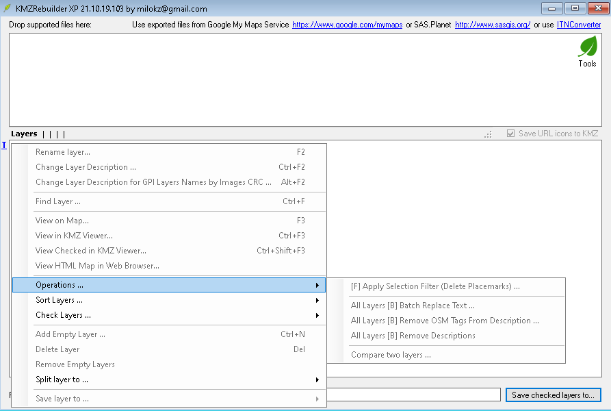     
Route Sample (вывод маршрутов)     
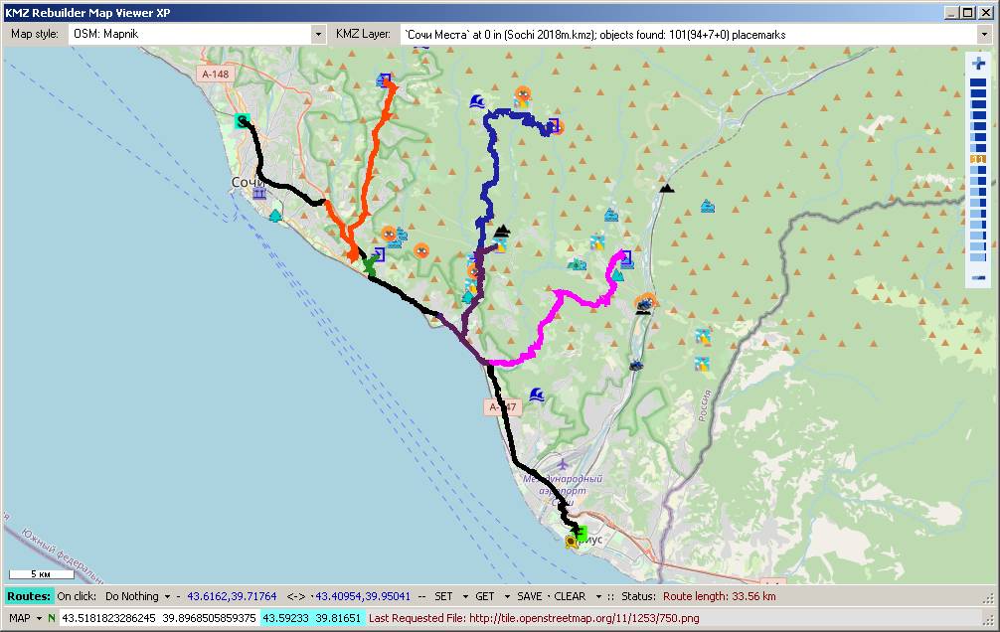     
